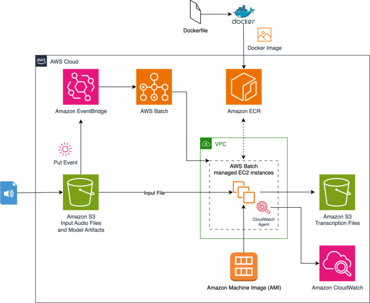
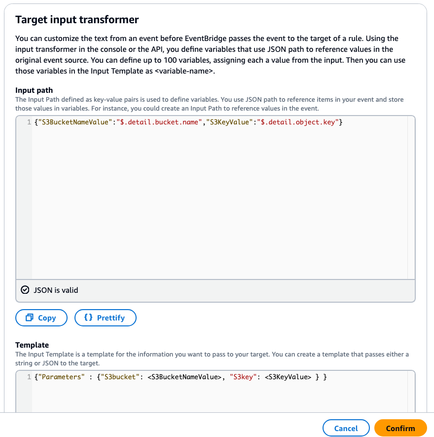

# Parakeet Audio Transcription powered by AWS Batch and NVIDIA GPUs

NVIDIA's Parakeet is a state-of-the-art automatic speech recognition (ASR) model based on the Transformer architecture. It delivers exceptional accuracy for long-form audio transcription and is optimized for production workloads.
For customers seeking to host the Parakeet model on AWS but do not need real-time or continuous online inference can optimize for cost by processing audio as a batch workload asynchronously using AWS Batch and by leveraging NVIDIA GPUs for high-performance inference. AWS Batch is a fully managed service that enables efficient scheduling and execution of batch computing workloads on the AWS Cloud. NVIDIA GPUs provide exceptional performance for deep learning inference workloads.

## Highlights of This Solution

### Features

1.1 Event-driven architecture with automatic job triggering on S3 file uploads

1.2 Scalable compute environment with automatic scaling based on job queue demand

1.3 Built-in retry mechanisms for robust processing

1.4 Pre-cached Parakeet v3 model in container image to eliminate download time during execution

1.5 Comprehensive monitoring with CloudWatch metrics for GPU, CPU, memory, and disk utilization

## Solution overview

The solution architecture shows the event-driven Parakeet audio transcription pipeline with Amazon EventBridge and AWS Batch. Since AWS Batch creates a containerized compute environment, it requires a container image to be built and staged in Amazon Elastic Container Registry (Amazon ECR).



Figure 1. Event-driven audio transcription pipeline with Amazon EventBridge and AWS Batch


The workflow consists of:

1. **Build docker image and push to Amazon ECR**
   - The docker image includes all libraries and Python script code to retrieve audio files from Amazon S3
   - Pre-cached Parakeet v3 model for faster startup times
   - Optimized for NVIDIA GPU inference

2. **Add audio transcription job to AWS Batch job queue on file upload**
   - When an audio file is uploaded to the designated S3 bucket and folder, Amazon EventBridge captures the event
   - EventBridge triggers AWS Batch to add the file to the job queue

3. **AWS Batch launches GPU compute resources to process queued jobs**
   - AWS Batch automatically scales the managed compute environment using G5/G6 instances
   - Instances pull the container image from Amazon ECR and process jobs with GPU acceleration
   - Amazon CloudWatch Agent will send collected CPU/GPU metrics for monitoring

4. **AWS Batch processes job and writes transcription to Amazon S3 output location**
   - Each audio file is processed using the Parakeet model with GPU acceleration
   - Transcription results are written to the designated S3 output location
   - Optional timestamp information is included for detailed analysis

## Implementing the solution

### Build the docker image

After cloning the GitHub repository, you can choose to use the updateImage.sh script to automate the image build and publish it to ECR.


Alternatively, you can follow the step by step instructions below if you want to go through the details. From the Dockerfile, the base image uses Amazon Linux 2023 with Python 3.12 and includes all necessary dependencies for NeMo and Parakeet.


Build the image using the following command:

```bash
docker build --no-cache -t parakeet:latest .
```

### Push image to AWS ECR

Create a repository in Amazon ECR and push the image:

```bash
# Create ECR repository
aws ecr create-repository --repository-name parakeet

# Tag the Docker image
docker tag parakeet:latest [your-account-id].dkr.ecr.[your-region].amazonaws.com/parakeet:latest

# Get ECR login credentials
aws ecr get-login-password | docker login --username AWS --password-stdin [your-account-id].dkr.ecr.[your-region].amazonaws.com

# Push the image
docker push [your-account-id].dkr.ecr.[your-region].amazonaws.com/parakeet:latest
```

### Deploy AWS Infrastructure

Deploy the CloudFormation template to create the AWS Batch environment:

#### Step 1. Prepare your VPC and networking components

Ensure you have:
- A VPC with public and private subnets
- Security groups allowing necessary traffic
- Route tables configured properly

#### Step 2. Deploy the CloudFormation stack

First of all, clone this repository and navigate to the project directory.

The buildArch.sh script will help you to automatically retrieve necessary information and deploy in the default VPC.

Alternatively, you can use the AWS CloudFormation template to accelerate the deployment of this solution. 

To deploy the CloudFormation stack using the AWS CLI:

```bash
aws cloudformation create-stack \
  --stack-name parakeet-batch-transcription \
  --template-body file://deployment.yaml \
  --parameters ParameterKey=VPCId,ParameterValue=your-vpc-id \
               ParameterKey=SubnetIds,ParameterValue=your-subnet-ids \
               ParameterKey=SGIds,ParameterValue=your-security-group-ids \
               ParameterKey=RTIds,ParameterValue=your-route-table-id \
  --capabilities CAPABILITY_IAM
```

#### Step 3. Monitor the deployment

Monitor the CloudFormation stack creation in the AWS Console. The deployment creates:
- AWS Batch compute environment with G5/G6 instances
- Job queue and job definition
- S3 buckets for input and output
- EventBridge rule for automatic job triggering
- CloudWatch monitoring configuration

### Configure EventBridge Rule (if not using CloudFormation)

If you need to manually configure the EventBridge rule:

#### Step 1. Create EventBridge Rule

In the Amazon EventBridge console, create a new rule with the following event pattern:

```json
{
  "detail-type": ["Object Created"],
  "source": ["aws.s3"],
  "detail": {
    "bucket": {
      "name": ["your-input-bucket-name"]
    },
    "object": {
      "key": [{
        "prefix": "input/"
      }]
    }
  },
  "account": ["your-account-id"]
}
```

#### Step 2. Configure Batch Target

Set the target as AWS Batch job queue and configure the input transformer to pass S3 bucket and key information to the job.

After selecting Batch job queue, you’ll be prompted to specify the Amazon Resource Names (ARNs) for the AWS Batch Job queue and the Job definition.

Under "Additional settings", choose  "Input transformer", then click "Configure input Transformer" button.

Set up "Input path" and "Template" like below. This will pass the S3 bucket name and the S3 object key to the triggered Batch job. Click Confirm and go to the next step.




## Test the solution

### Step 1. Upload test audio files

Upload audio files to your S3 input bucket in the `input/` folder:

```bash
aws s3 cp your-audio-file.wav s3://your-input-bucket/input/
```

### Step 2. Monitor job execution

Monitor the job execution in the AWS Batch console:
- Check job queue for submitted jobs
- Monitor job status and logs
- View CloudWatch metrics for GPU utilization

### Step 3. Retrieve transcription results

Check the output S3 bucket for transcription results:

```bash
aws s3 ls s3://your-output-bucket/transcription-output/
aws s3 cp s3://your-output-bucket/transcription-output/your-audio-file.wav.txt ./
```

## Monitoring and Observability

The solution includes comprehensive monitoring:

### CloudWatch Metrics

Metrics are published to the **CWAgent** namespace. To view them in the CloudWatch console:
1. Navigate to CloudWatch > Metrics > All metrics
2. Select the **CWAgent** namespace
3. Filter by InstanceId or AutoScalingGroupName

Available metrics:
- **GPU Metrics**: utilization, power draw, memory utilization
- **System Metrics**: CPU usage, memory utilization, disk usage

### CloudWatch Logs
- AWS Batch job execution logs
- Application-specific logging


## Troubleshooting

### Common Issues

1. **Model download failures**: Ensure internet connectivity and sufficient disk space
2. **GPU memory errors**: Adjust batch size or use smaller model variants
3. **S3 access issues**: Verify IAM permissions and bucket policies
4. **Job timeouts**: Increase timeout values for large audio files

### Debugging Steps

1. Check CloudWatch logs for detailed error messages
2. Verify S3 bucket permissions and EventBridge configuration
3. Test container locally before deploying to Batch
4. Monitor GPU utilization and memory usage


## Cleanup

To avoid incurring future charges, delete the resources created by this solution:

**Note:** S3 versioning is disabled in this sample for simplified cleanup. For production use, consider enabling versioning for data protection.

### Step 1. Empty S3 Buckets

Before deleting the CloudFormation stack, you must empty all S3 buckets:

```bash
# Set your stack name
STACK_NAME=batch-gpu-audio-transcription

# Get bucket names from CloudFormation stack
INPUT_BUCKET=$(aws cloudformation describe-stacks --stack-name $STACK_NAME --query "Stacks[0].Outputs[?OutputKey=='InputBucket'].OutputValue" --output text)
OUTPUT_BUCKET=$(aws cloudformation describe-stacks --stack-name $STACK_NAME --query "Stacks[0].Outputs[?OutputKey=='OutputBucket'].OutputValue" --output text)
LOG_BUCKET=$(aws cloudformation describe-stacks --stack-name $STACK_NAME --query "Stacks[0].Outputs[?OutputKey=='LogBucket'].OutputValue" --output text)

# Empty the buckets (versioning is disabled for simplified cleanup)
aws s3 rm s3://${INPUT_BUCKET} --recursive --no-cli-pager
aws s3 rm s3://${OUTPUT_BUCKET} --recursive --no-cli-pager
aws s3 rm s3://${LOG_BUCKET} --recursive --no-cli-pager

echo "All buckets emptied successfully"
```

### Step 2. Delete CloudFormation Stack

Delete the CloudFormation stack to remove all associated resources:

```bash
aws cloudformation delete-stack --stack-name batch-gpu-audio-transcription
```

Monitor the deletion progress:

```bash
aws cloudformation describe-stacks --stack-name batch-gpu-audio-transcription --query "Stacks[0].StackStatus"
```

### Step 3. Delete ECR Repository (Optional)

If you want to remove the container images:

```bash
aws ecr delete-repository --repository-name parakeet --force
```

### Step 4. Verify Cleanup

Verify that all resources have been deleted:

```bash
# Check CloudFormation stack status
aws cloudformation describe-stacks --stack-name batch-gpu-audio-transcription

# Check S3 buckets
aws s3 ls | grep batch-gpu-audio-transcription

# Check ECR repository
aws ecr describe-repositories --repository-names parakeet
```

**Note:** The CloudFormation stack deletion will automatically remove:
- AWS Batch compute environment, job queue, and job definition
- EventBridge rule
- IAM roles and policies
- VPC endpoints
- CloudWatch log groups
- SSM parameters


## License

This library is licensed under the MIT-0 License. See the LICENSE file.

## Contributing

See [CONTRIBUTING](CONTRIBUTING.md) for more information on how to contribute to this project.